<div align="center">
  <picture>
    <source media="(prefers-color-scheme: dark)" srcset=".github/readme/banner-dark.svg">
    
  </picture>

  <p>An OpenCode plugin that rewrites your messages with a small model before your main model reads them, turning rushed requests into clear, specific ones. Your chat keeps showing exactly what you typed, and if the rewrite fails, your original goes through.</p>

  <p>
    <a href="https://github.com/cosminfuica/opencode-prompt-optimizer/stargazers"></a>
    &nbsp;
    <a href="package.json"></a>
    &nbsp;
    <a href="https://github.com/cosminfuica/opencode-prompt-optimizer/actions/workflows/ci.yml"></a>
    &nbsp;
    <a href="LICENSE"></a>
  </p>

  <p>
    <a href="#quick-start"><picture><source media="(prefers-color-scheme: dark)" srcset=".github/readme/cta-start-dark.svg"></picture></a>
    &nbsp;
    <a href="https://github.com/user-attachments/assets/0c7bc5de-f548-4fc0-84d2-2f2d384179fa"><picture><source media="(prefers-color-scheme: dark)" srcset=".github/readme/cta-demo-dark.svg"></picture></a>
  </p>

  <p>
    <a href="#how-it-works"><b>How it works</b></a> &middot;
    <a href="#quick-start"><b>Quick start</b></a> &middot;
    <a href="#usage"><b>Usage</b></a> &middot;
    <a href="#configuration"><b>Configuration</b></a> &middot;
    <a href="#contributing"><b>Contributing</b></a>
  </p>

https://github.com/user-attachments/assets/0c7bc5de-f548-4fc0-84d2-2f2d384179fa

  <p align="center">
    <picture><source media="(prefers-color-scheme: dark)" srcset=".github/readme/spec-1-dark.svg">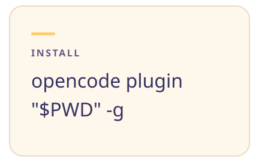</picture><picture><source media="(prefers-color-scheme: dark)" srcset=".github/readme/spec-2-dark.svg">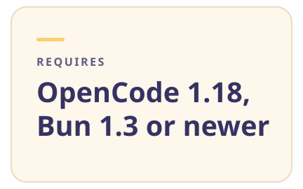</picture><picture><source media="(prefers-color-scheme: dark)" srcset=".github/readme/spec-3-dark.svg">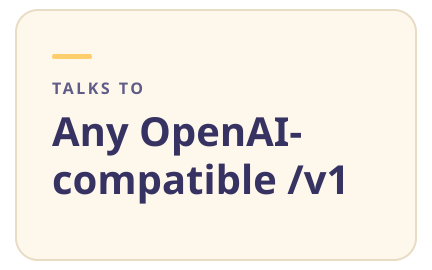</picture><picture><source media="(prefers-color-scheme: dark)" srcset=".github/readme/spec-4-dark.svg">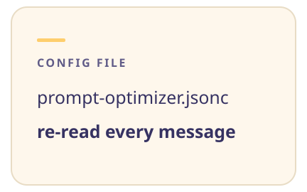</picture>
    <picture><source media="(prefers-color-scheme: dark)" srcset=".github/readme/spec-5-dark.svg">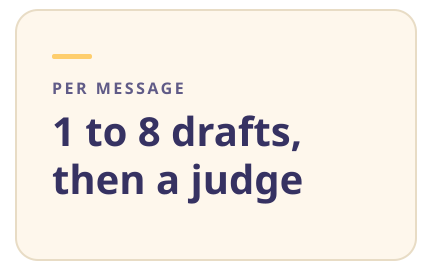</picture><picture><source media="(prefers-color-scheme: dark)" srcset=".github/readme/spec-6-dark.svg">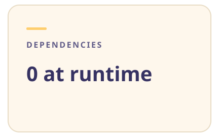</picture><picture><source media="(prefers-color-scheme: dark)" srcset=".github/readme/spec-7-dark.svg">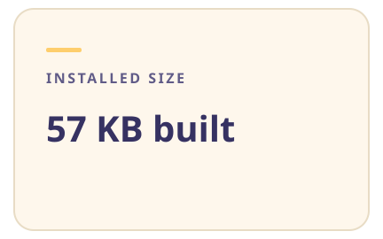</picture><picture><source media="(prefers-color-scheme: dark)" srcset=".github/readme/spec-8-dark.svg"></picture>
  </p>
</div>

<picture><source media="(prefers-color-scheme: dark)" srcset=".github/readme/rule-dark.svg"></picture>

<p align="center">
  <picture><source media="(prefers-color-scheme: dark)" srcset=".github/readme/tile-preview-dark.webp">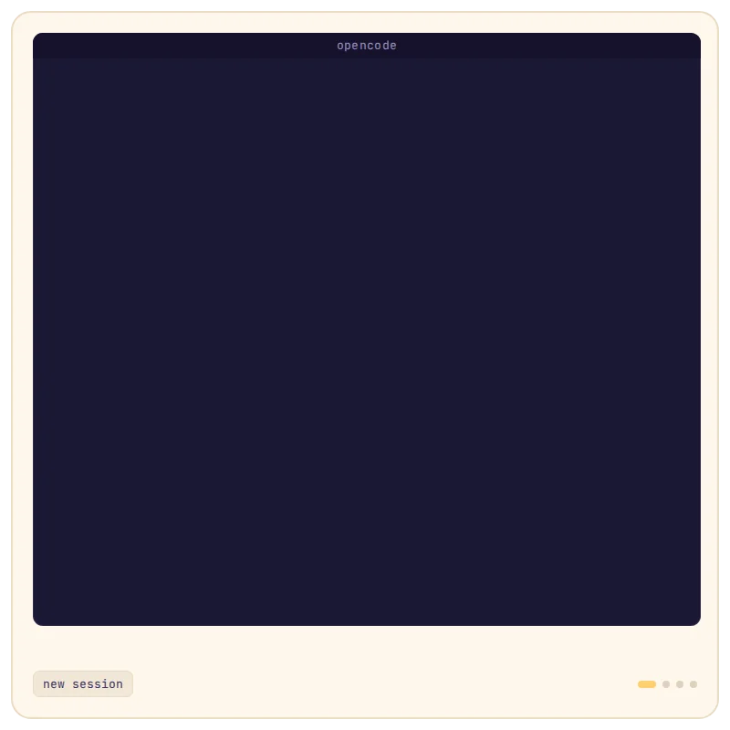</picture><picture><source media="(prefers-color-scheme: dark)" srcset=".github/readme/tile-stack-1-2-dark.webp">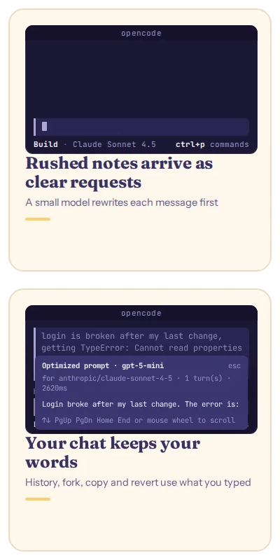</picture>
  <picture><source media="(prefers-color-scheme: dark)" srcset=".github/readme/tile-feature-3-dark.webp">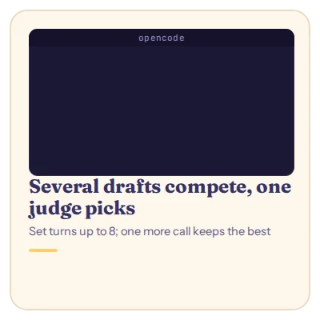</picture><picture><source media="(prefers-color-scheme: dark)" srcset=".github/readme/tile-feature-4-dark.webp">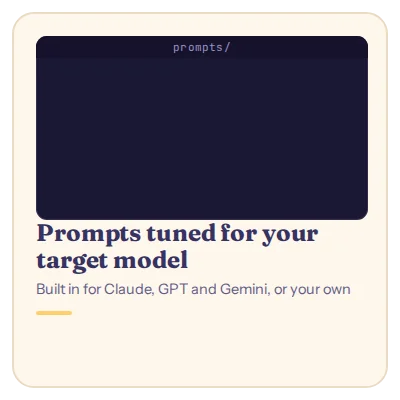</picture><picture><source media="(prefers-color-scheme: dark)" srcset=".github/readme/tile-feature-5-dark.webp">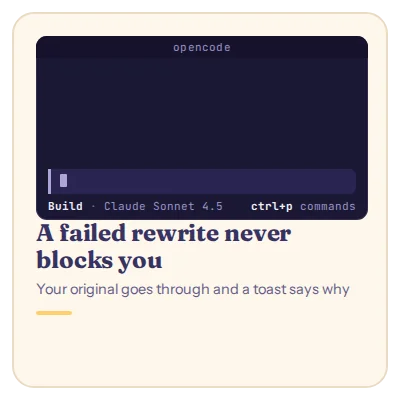</picture>
  <picture><source media="(prefers-color-scheme: dark)" srcset=".github/readme/tile-code-dark.webp">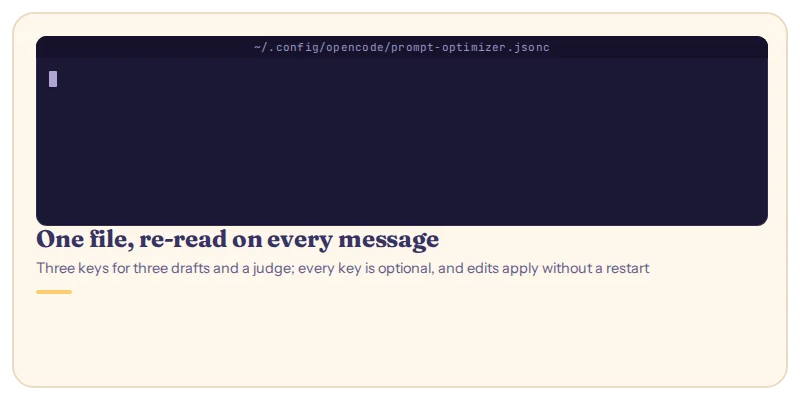</picture><picture><source media="(prefers-color-scheme: dark)" srcset=".github/readme/tile-list-dark.webp"></picture>
</p>

<picture><source media="(prefers-color-scheme: dark)" srcset=".github/readme/rule-dark.svg"></picture>

## How it works

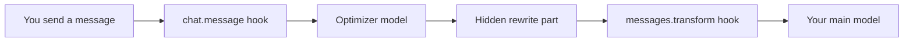

The `chat.message` hook sends your text to the optimizer and attaches the rewrite to your message as a hidden (`synthetic`) part, so the chat still shows what you typed. Before every model request, the `experimental.chat.messages.transform` hook swaps the rewrite in for your words, so earlier messages stay optimized too. Every hook catches its own errors, so a failure never blocks a message. [docs/design.md](docs/design.md) has the module contracts.

## Quick start

```console
$ git clone https://github.com/cosminfuica/opencode-prompt-optimizer.git
$ cd opencode-prompt-optimizer
$ bun install && bun run build
$ opencode plugin "$PWD" -g
┌  Install plugin /home/dev/opencode-prompt-optimizer
│
◇  Plugin package ready
│
◇  Detected server + tui targets
│
◇  Plugin config updated
│
●  Added to /home/dev/.config/opencode/opencode.jsonc
│
●  Added to /home/dev/.config/opencode/tui.json
│
◆  Installed /home/dev/opencode-prompt-optimizer
│
●  Scope: global (/home/dev/.config/opencode)
│
└  Done
```

You need [Bun](https://bun.sh) and [OpenCode](https://opencode.ai) (this run used Bun 1.3.14 and OpenCode 1.18.34). Start (or restart) OpenCode and send a message of 20 characters or more: a toast shows the optimizer at work, then a preview of the rewrite.

> [!TIP]
> The rewriting uses your OpenCode `small_model`. To pick another model, a local one, or any OpenAI-compatible endpoint, set `model` or `baseURL` as described in [Configuration](#configuration).

## Usage

| Command or setting | What it does |
|--------------------|--------------|
| `/optimized` | Opens the session's latest rewrite with the optimizer model, the target model, the turns and the time it took. Also in the command palette (<kbd>Ctrl</kbd>+<kbd>P</kbd>) as "Show optimized prompt". |
| `model` | The optimizer: a `"provider/model"` from your OpenCode config, or the raw model name when `baseURL` is set. Defaults to OpenCode's `small_model`. |
| `baseURL`, `apiKey` | A custom OpenAI-compatible endpoint (the `/v1` root) and its key. OpenCode's provider keys are never sent there. |
| `turns`, `strategy` | Rewrites per message, 1 to 8 (default 1), written `"parallel"` (default) or `"refine"` (each improving the last). Above 1, one more call picks the best. |
| `prompts`, `judgePrompt` | Your own system prompts, keyed by case-insensitive globs matched against the target `provider/model`; `default` is the fallback. An optimizer prompt must ask for the reply inside `<optimized_prompt>` tags, a judge prompt for `<best>k</best>`. |
| `minChars`, `skipPatterns` | Messages shorter than 20 characters (default) or matching one of these regexes go through unchanged. |
| `enabled`, `toast` | Pause the plugin, or hide the progress and success toasts. Failure toasts always show. |
| `timeoutMs`, `headers`, `body` | Per-request timeout (default 60000 ms), extra HTTP headers, and extra request fields such as `temperature` or `max_tokens`. |

Every setting is optional. A config file with three drafts and a judge:

```jsonc
// ~/.config/opencode/prompt-optimizer.jsonc
{
  "model": "openai/gpt-5-mini",
  "turns": 3,
  "strategy": "parallel"
}
```

## Configuration

<details>
<summary><b>Which messages are left alone, and what does it cost?</b></summary>

Messages shorter than `minChars`, slash commands, subagent sessions and anything matching `skipPatterns` (by default, other plugins' automated prompts and text that starts like a slash command) go through unchanged, with no extra call. Every other message waits for one optimizer call before the main model starts, or N + 1 calls with `turns` set to N; `"parallel"` keeps the wait near two calls. A small or local model keeps both the wait and the cost low.

</details>

<details>
<summary><b>Which model does the rewriting?</b></summary>

OpenCode's `small_model`, unless you set `model`. A `"provider/model"` from your OpenCode config reuses that provider's base URL, headers and API key, including a key saved with `opencode auth login`. It works for providers with an OpenAI-compatible chat API: `@ai-sdk/openai-compatible` providers, OpenAI, Anthropic, Google, OpenRouter, Groq, Mistral, DeepSeek and xAI.

</details>

<details>
<summary><b>Can I use a local model, OpenRouter or another endpoint?</b></summary>

Yes. Set `baseURL` to any OpenAI-compatible `/v1` root and `model` to the raw model name. `<think>` blocks from reasoning models are stripped.

```jsonc
// Ollama
{ "baseURL": "http://localhost:11434/v1", "model": "qwen3:8b" }
// OpenRouter
{
  "baseURL": "https://openrouter.ai/api/v1",
  "apiKey": "{env:OPENROUTER_API_KEY}",
  "model": "google/gemini-2.5-flash"
}
```

</details>

<details>
<summary><b>Where do settings go, and do I need to restart?</b></summary>

In `~/.config/opencode/prompt-optimizer.jsonc` (`$XDG_CONFIG_HOME` is respected, `prompt-optimizer.json` works too, and `$OPENCODE_PROMPT_OPTIMIZER_CONFIG` points to another file). It's re-read on every message, so edits apply without a restart. The same keys work as plugin options in `opencode.json`, read when OpenCode starts; the file wins for any key both set. Any string can use `{env:VAR}` and `{file:path}`. [examples/](examples/) has a fully commented config.

</details>

<details>
<summary><b>How do I write my own prompts?</b></summary>

Put them under `prompts`, keyed by globs matched against the target `provider/model` (`"anthropic/claude-opus-*"`, `"*gemini*"`, `"default"`), as inline text or `{file:~/prompts/opus.md}`. The built-in prompts in [prompts/](prompts/) share one skeleton and tell the optimizer to keep file paths, errors, code and other tools' injected text verbatim; a custom one must ask for the reply inside `<optimized_prompt>` tags, and `judgePrompt` for `<best>k</best>`, or the call fails and your original is sent.

</details>

<details>
<summary><b>Can I set it up without the <code>opencode plugin</code> command?</b></summary>

Yes. Put your checkout's absolute path in `plugin` in `opencode.json` (the global one in `~/.config/opencode/` or your project's) for the rewriting, and the same entry in the `tui.json` next to it for `/optimized`. Without `-g`, `opencode plugin` writes them for the current project only.

```json
{ "plugin": ["/absolute/path/to/opencode-prompt-optimizer"] }
```

</details>

<details>
<summary><b>What are the known limits, and where are the logs?</b></summary>

- The optimizer needs an API key: OAuth and subscription logins (such as ChatGPT or Claude Pro) can't be used, and providers with an Anthropic-format or `${VAR}` URL need a custom `baseURL`.
- It isn't published to npm; install it from a local build as in [Quick start](#quick-start), and update with `git pull && bun run build`, then restart OpenCode.
- OpenCode's session-title request skips the transform hook, so the title model sees your first message and its rewrite.
- When a rewrite fails, your original is sent and a toast says why. The logs have the details: `grep prompt-optimizer ~/.local/share/opencode/log/*.log`.

</details>

## Contributing

```bash
git clone https://github.com/cosminfuica/opencode-prompt-optimizer.git
cd opencode-prompt-optimizer
bun install
bun test && bun run typecheck
```

Found a bug or want a feature? [Open an issue](https://github.com/cosminfuica/opencode-prompt-optimizer/issues). For changes to the hooks or the TUI, also run `bun run e2e` and `bun run tui-smoke` (they need `opencode` on your `PATH`, and the TUI test needs `tmux`); [docs/design.md](docs/design.md) describes the contracts between the modules.

<picture><source media="(prefers-color-scheme: dark)" srcset=".github/readme/contribute-dark.svg"></picture>

## License

MIT - see [LICENSE](LICENSE).

<div align="center">
  <picture>
    <source media="(prefers-color-scheme: dark)" srcset=".github/readme/outro-dark.svg">
    
  </picture>
  <p><a href="#readme">Back to top</a></p>
</div>
