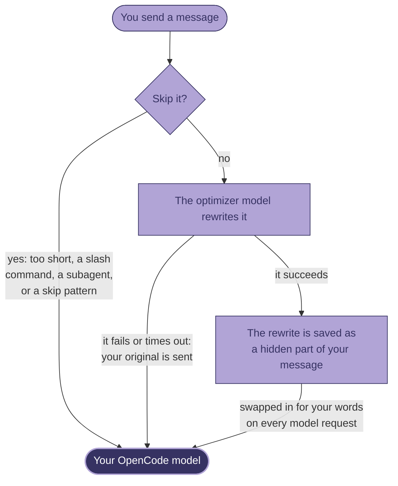

<div align="center">


# OpenCode Prompt Optimizer

**A little ghostwriter for your prompts.**

It turns quick, messy messages into clear requests before your [OpenCode](https://opencode.ai) model reads them.
Your chat keeps showing exactly what you typed.

[](https://opencode.ai)
[](https://www.npmjs.com/package/@cosminfuica/opencode-prompt-optimizer)
[](package.json)
[](LICENSE)

[Quick start](#quick-start) · [How it works](#how-it-works) · [Configuration](#configuration) · [FAQ](#faq) · [Troubleshooting](#troubleshooting)

<br>


</div>

## What it does

Coding agents do their best work with clear, specific requests. But when you're busy, you type something closer to
"login broken pls fix". This plugin sends each message through a small, fast optimizer model first. The optimizer
rewrites it into a clear, explicit request, and that rewrite is what your main model reads.

<table>
<tr><th width="42%">You type</th><th width="58%">Your model reads a rewrite like</th></tr>
<tr>
<td valign="top">

login is broken after my last change, getting TypeError: Cannot read properties of undefined (reading 'id') in src/auth/session.ts, pls fix

</td>
<td valign="top">

Login broke after my last change. The error is:

TypeError: Cannot read properties of undefined (reading 'id')

It points at src/auth/session.ts. Starting from that file and my recent changes, find the cause and fix it so login
works again.

</td>
</tr>
<tr>
<td valign="top">

fix the typo in teh README install section

</td>
<td valign="top">

Fix the typo in the install section of the README.

</td>
</tr>
</table>

Both examples come from the built-in prompt, [`prompts/default.md`](prompts/default.md). The second shows that a
short, clear request stays short. Real rewrites depend on your optimizer model.

The built-in prompts are careful. They keep your intent and your language, copy file paths, errors and code exactly,
leave an already-clear prompt essentially unchanged, and never do the task themselves.

## Highlights

- **Your chat stays yours.** The rewrite rides along as a hidden part of your message and is swapped in only for the
  model. Your message bubble, history, fork, copy and revert all use what you typed.
- **Tuned to the model you're talking to.** Built-in optimizer prompts for Claude, GPT and Gemini, plus a general
  default, are picked by the model your message is going to. You can bring your own, matched by glob.
- **Several drafts, one judge.** Set `turns` above 1 to write several rewrites, all at once or each refining the
  last, and let one more call pick the best.
- **Any OpenAI-compatible model.** Reuse a provider from your OpenCode config, or point the plugin at OpenRouter,
  Ollama, LM Studio or another `/chat/completions` endpoint. `<think>` blocks from reasoning models are stripped.
- **Fails safe.** If the optimizer fails or times out, your original prompt goes through and a toast tells you why.
- **Nothing hidden.** A toast previews each rewrite, and `/optimized` opens the full text.
- **Stays out of the way.** Short messages, slash commands, subagent sessions and other plugins' automated prompts
  pass through unchanged.
- **Light and live.** No runtime dependencies. Config edits apply from your next message, with no restart.

## Quick start

**1. Install it.** This package supports OpenCode v1 and v2. Let your version add the plugin:

```sh
# OpenCode v1; drop -g to install for the current project only
opencode plugin @cosminfuica/opencode-prompt-optimizer -g

# OpenCode v2
opencode plugin add @cosminfuica/opencode-prompt-optimizer
```

<details>
<summary>Or edit the config files yourself</summary>

Add the plugin to `opencode.json`, either the global `~/.config/opencode/opencode.json` or the one in your project.
OpenCode installs it from npm the next time it starts. Use `plugin` in v1 and `plugins` in v2:

```json
// OpenCode v1
{
  "plugin": ["@cosminfuica/opencode-prompt-optimizer"]
}
```

```json
// OpenCode v2
{
  "plugins": ["@cosminfuica/opencode-prompt-optimizer"]
}
```

In v1, add the same entry to the `tui.json` next to it (`~/.config/opencode/tui.json` for the global setup). That entry
adds the `/optimized` command. V2 loads the package's TUI entry from the `plugins` setting, so no separate `tui.json`
entry is needed.

</details>

**2. Model selection.** On **v2.0.18**, no optimizer configuration is needed: it uses the current session's selected
model and variant for an isolated generation request. On **v1.18.32**, it uses `small_model`. To choose a separate optimizer, set a model in
`~/.config/opencode/prompt-optimizer.jsonc`:

```jsonc
{ "model": "openai/gpt-5-mini" }
```

A `"provider/model"` from your OpenCode config reuses that provider's key. Local and custom endpoints work too, see
[Choosing the optimizer model](#choosing-the-optimizer-model).

**3. Chat as usual.** A toast previews each successful rewrite. The model gets the rewrite; your chat shows what you
typed. Set `"toast": false` to hide success notifications. V2 also supports `/optimize <request>` to optimize and send.

**Supported APIs:** OpenCode v1.18.32 and v2.0.18. V1 and explicit `baseURL` overrides require an OpenAI-compatible
`/chat/completions` endpoint. V2 uses OpenCode's standalone generation API and globally configured provider credentials.
Authentication plugins that require session hooks are not supported by that API; use an explicit `baseURL` in that case.

### Install a development checkout globally

Before this change is released to npm, use the fork's built installation branch:

```sh
git clone --branch installable-v2 https://github.com/sRaH/opencode-prompt-optimizer.git "$HOME/.config/opencode/plugins/opencode-prompt-optimizer"
```

Add the **absolute checkout path** to `plugins` in `~/.config/opencode/opencode.json`, preserving existing entries:

```json
{ "plugins": ["/absolute/path/to/.config/opencode/plugins/opencode-prompt-optimizer"] }
```

Run `opencode service restart` and restart the TUI. Root `server.js` and `tui.js` files enable local discovery.
Update with `git -C "$HOME/.config/opencode/plugins/opencode-prompt-optimizer" pull --ff-only`.
After updating, restart the service again: `opencode reload` can retain the previous plugin module in memory.
Standalone or externally managed servers must be restarted through their own launcher.
If an older version submitted optimizer instructions into a conversation, start a new session; updating the plugin
does not remove those instructions from existing chat history.
For a source checkout without committed `dist`, run `bun install` and `npm run build` first.
The registry command above installs the published version, which may not yet include these changes.

### See what was sent

Type `/optimized`, or pick **Show optimized prompt** in the command palette (<kbd>Ctrl</kbd>+<kbd>P</kbd>). It opens
the latest optimized prompt of the current session. The header shows the optimizer model, the target model, the number
of turns and how long the optimization took. With several candidates, it also shows which one won and whether the
judge picked it.

To scroll, use <kbd>↑</kbd>/<kbd>↓</kbd> or <kbd>j</kbd>/<kbd>k</kbd> for a line, <kbd>PgUp</kbd>/<kbd>PgDn</kbd> for
a page, <kbd>Home</kbd>/<kbd>End</kbd> for the top or bottom, or the mouse wheel. <kbd>Enter</kbd> or <kbd>Esc</kbd>
closes the dialog. On v1, the command needs the `tui.json` entry from [Quick start](#quick-start).

## How it works



The rewrite is stored in a hidden (`synthetic`) part on v1, or message metadata on v2, so the chat keeps your words. Before every model
request, a transform hook swaps the rewrite in for your text, so earlier messages stay optimized too. An optimized
message waits for one optimizer round trip, or N + 1 calls with `turns` > 1, before the main model starts.

### What isn't optimized

These messages go to the model unchanged, with no toast:

- messages shorter than `minChars` (20 characters by default), such as "yes" or "continue"
- slash-command text (v1 also skips rendered command templates); v2 `/optimize` deliberately submits an ordinary request
- messages in subagent (task) sessions
- messages that match `skipPatterns`, which by default cover other plugins' automated prompts and text that starts
  like a slash command

To pause the optimizer, set `"enabled": false` in `prompt-optimizer.jsonc`. It applies from the next message, with no
restart.

<details>
<summary><b>Under the hood</b>: hooks, files and what gets published</summary>

<br>

The package has two halves, and OpenCode loads both through `package.json`.

**V1 server** (`dist/index.js` through `main`, also available through `dist/server.js`), loaded from `opencode.json`:

- `chat.message` runs when you send a message. Unless the message is skipped, it resolves the optimizer endpoint and
  runs the rewrite calls, plus the judge call when there are several candidates. Then it appends the result to your
  message as a hidden `synthetic` text part. That part's `metadata.promptOptimizer` holds your original text, the
  models, the candidates, the chosen index and the timing. Your own text part isn't changed.
- `experimental.chat.messages.transform` runs before every model request, on that request's copy of the history, and
  swaps the optimized text in for your words. Earlier messages stay optimized too.
- `command.execute.before` marks slash-command runs so their rendered templates aren't optimized.

**V2 server** (`dist/server.js`, also exposed by root `server.js` for local discovery) registers `prompt`
and `context` hooks. It generates candidates through standalone requests using the selected model, without a session
ID, conversation history, tools or agent instructions. Results live in message metadata; only the model request copy
is rewritten. `/optimize` submits a request once.

**TUI plugin** (`dist/tui.js`, from `exports["./tui"]`, or root `tui.js` for local discovery) supports both host APIs.
It registers `/optimized`, which reads
that metadata from the session and shows it. It only displays the prompt. Nothing is sent to the model.

Each hook catches its own errors, so a failure never blocks your message. Your original prompt goes through instead.
If v2's context hook stops running, the model receives the original text.

```text
.
├── src/
│   ├── index.ts        legacy v1 server entry
│   ├── server.ts       dual server module: v1 server and v2 setup
│   ├── v2.ts           native v2 session hooks and /optimize
│   ├── tui-v2.ts       native v2 /optimized preview and notifications
│   ├── hooks.ts        chat.message, command.execute.before, messages.transform
│   ├── optimizer.ts    endpoint resolution, HTTP calls, turns + judge
│   ├── config.ts       config loading, validation, prompt selection
│   └── tui.ts          TUI entry: the /optimized command and dialog
├── prompts/            built-in optimizer prompts (anthropic, gpt, gemini, default) and the judge prompt
├── tests/              unit tests, e2e and TUI smoke tests, a live test script, a mock OpenAI server
├── examples/           opencode.json, tui.json, prompt-optimizer.jsonc
├── assets/             logo and README images
├── docs/design.md      the full design and module contracts
├── dist/               compiled output (built by tsc, published, not committed)
└── package.json        main, exports["./server"] and exports["./tui"] point into dist/
```

The published package contains `dist/`, `prompts/`, root discovery shims, this README, the license and `package.json`.

</details>

## Configuration

Every setting is optional. V2 needs none by default. There are two places to put settings:

1. **The config file** at `~/.config/opencode/prompt-optimizer.jsonc` (`$XDG_CONFIG_HOME` is respected, and
   `prompt-optimizer.json` works too). Set `$OPENCODE_PROMPT_OPTIMIZER_CONFIG` to use another path. The file is
   JSONC, so comments and trailing commas are allowed. It's re-read on every message, so edits apply without a
   restart.
2. **Plugin options** in `opencode.json`, read when OpenCode starts:

   ```json
   {
     "plugin": [
       ["@cosminfuica/opencode-prompt-optimizer", { "model": "openai/gpt-5-mini", "turns": 2 }]
     ]
   }
   ```

Both accept the same keys and use the same validation. If both set a key, the config file wins for that top-level key.
[`examples/`](examples/) has a fully commented `prompt-optimizer.jsonc`, plus `opencode.json` and `tui.json`.

| Key | Default | Description |
|---|---|---|
| `enabled` | `true` | Master switch. |
| `model` | v1: `small_model`; v2: session model | Optional `"provider/model"` override, or raw model name when `baseURL` is set. |
| `baseURL` | none | A custom OpenAI-compatible endpoint (`…/v1`). Requires `model`. |
| `apiKey` | none | API key for `baseURL`, ignored without it. OpenCode's provider keys are never sent to a custom `baseURL`. |
| `headers` | `{}` | Extra HTTP headers for v1 or explicit `baseURL`. Native v2 uses provider settings. |
| `body` | `{}` | HTTP body fields for v1/`baseURL`. Native v2 standalone generation does not expose request-body overrides. |
| `turns` | `1` | Rewrite calls per message, 1 to 8. With N > 1, one more judge call picks the best: N + 1 calls in total. |
| `strategy` | `"parallel"` | How the N calls run: `"parallel"` makes N independent rewrites at once, `"refine"` makes them one after another, each improving the previous one. |
| `timeoutMs` | `60000` | Timeout for each request, in milliseconds (at least 1000). |
| `minChars` | `20` | Messages shorter than this, after trimming, are sent unchanged. |
| `skipPatterns` | see below | Regexes. A message that matches any of them is sent unchanged. |
| `toast` | `true` | Show success notifications (and v1's "Optimizing…" toast). Failure toasts always show. |
| `prompts` | built-ins | Optimizer system prompts, chosen by the **target** model. See [Prompts per target model](#prompts-per-target-model). |
| `judgePrompt` | `prompts/judge.md` | System prompt for the judge call. |

Any string in the config file can use `{env:VAR}` and `{file:path}`. The path is relative to the config file, and
`~/` means your home directory. `opencode.json` supports the same syntax.

A config error never blocks your message: your original prompt is sent, and a warning toast names the problem.

The default `skipPatterns` skip other plugins' automated prompts and text that starts like a slash command. Setting
`skipPatterns` replaces this list:

```json
["<!--\\s*OMO_INTERNAL", "^\\s*\\[SYSTEM DIRECTIVE", "^/[\\w.-]+(\\s|$)"]
```

### Choosing the optimizer model

On v2, omit `model` to use the current session's selected model in an independent request. Changing the session model
also changes the optimizer on the next message. Providers are resolved from global configuration, without session
authentication hooks. Subscription/OAuth plugins that require those hooks need an explicit endpoint override.
A timeout releases your prompt, but native generation exposes no cancellation;
an already-running provider request may finish in the background.

A `"provider/model"` from your OpenCode config reuses that provider's base URL, API key and headers:

```jsonc
{ "model": "openai/gpt-5-mini" }
```

On v1 this works for providers with an OpenAI-compatible chat API: `@ai-sdk/openai-compatible` providers with a `baseURL`,
OpenAI, Anthropic, Google, OpenRouter, Groq, Mistral, DeepSeek and xAI. For anything else, set a custom endpoint:

```jsonc
// OpenRouter
{ "baseURL": "https://openrouter.ai/api/v1", "apiKey": "{env:OPENROUTER_API_KEY}", "model": "google/gemini-2.5-flash" }
```

```jsonc
// Ollama
{ "baseURL": "http://localhost:11434/v1", "model": "qwen3:8b" }
```

```jsonc
// LM Studio
{ "baseURL": "http://localhost:1234/v1", "model": "qwen2.5-7b-instruct", "body": { "temperature": 0.3, "max_tokens": 2048 } }
```

### Several candidates, one judge


With `turns` above 1, the plugin writes several rewrites, and one more call, the judge, picks the best. `"parallel"`,
the default, writes them all at once. `"refine"` writes them one after another, each improving the last.

With `parallel`, failed calls are dropped. With `refine`, a failed call ends the chain and the candidates so far are
kept. If only one candidate is left, it's used without a judge call. If the judge call fails or gives no valid answer,
`parallel` uses the first candidate and `refine` uses the last one. If every call fails, your original prompt is sent.

<br clear="right">
<br>

```jsonc
{ "turns": 3, "strategy": "parallel" }   // 3 rewrites at once + 1 judge = 4 calls, latency of about 2 calls
{ "turns": 3, "strategy": "refine" }     // rewrite → improve → improve, then judge = 4 calls in a row
```

### Prompts per target model

The keys in `prompts` are case-insensitive globs (`*`, `?`), matched against the target model as
`"providerID/modelID"`. They're tried in order and the first match wins. `default` is the fallback. Values are inline
text or `{file:…}`.

```jsonc
{
  "prompts": {
    "anthropic/claude-opus-*": "{file:~/prompts/opus.md}",
    "ollama/*": "Rewrite the prompt to be short and explicit. Reply inside <optimized_prompt></optimized_prompt>.",
    "default": "{file:~/prompts/default.md}"
  }
}
```

Without `prompts`, the built-ins apply: `*claude*` uses `prompts/anthropic.md`, `*gpt*` uses `prompts/gpt.md`,
`*gemini*` uses `prompts/gemini.md`, and everything else uses `prompts/default.md`. Your own `prompts` map replaces
them. If it has no `default` key, the built-in default is the fallback.

A custom prompt must tell the model to reply inside `<optimized_prompt>…</optimized_prompt>`. A reply with no
non-empty block, or one cut off at `max_tokens`, is discarded. A custom `judgePrompt` must make the judge reply with
`<best>k</best>`, where k is the 1-based index of the winner.

## FAQ

<details>
<summary><b>Will it change what I see in the chat?</b></summary>

<br>

No. Your message bubble, history, fork, copy and revert all use what you typed. Only the model gets the rewrite. To
see it, use the toast preview or `/optimized`.

</details>

<details>
<summary><b>Does it slow things down or cost extra?</b></summary>

<br>

A little. Each optimized message makes one extra call to the optimizer model, and the main model starts after it
replies. With `turns` > 1 it's N + 1 calls. `"parallel"` keeps the wait at about two calls. A small, fast model, or a
local one, keeps both the wait and the cost low. Skipped messages make no optimizer call.

</details>

<details>
<summary><b>Will it mangle my code, file paths or error messages?</b></summary>

<br>

The built-in prompts tell the optimizer to copy code, paths, identifiers, errors and quoted text character for
character, and to keep text that other tools added around your words verbatim. It's still a model, so `/optimized`
is there if you want to check.

</details>

<details>
<summary><b>I don't write in English. Does it still work?</b></summary>

<br>

Yes. The built-in prompts tell the optimizer to write in the language you used. A message in Romanian gets a
rewrite in Romanian.

</details>

<details>
<summary><b>Can I use a local model?</b></summary>

<br>

Yes. Anything with an OpenAI-compatible `/chat/completions` API works, including Ollama and LM Studio. See
[Choosing the optimizer model](#choosing-the-optimizer-model).

</details>

<details>
<summary><b>Where does my prompt go?</b></summary>

<br>

Besides your usual OpenCode model, only to the optimizer endpoint you configure. When you set a custom `baseURL`, the
plugin sends only the `apiKey` you gave it. OpenCode's provider keys are never sent there.

</details>

<details>
<summary><b>How do I turn it off for a while?</b></summary>

<br>

Set `"enabled": false` in `prompt-optimizer.jsonc`. It applies from the next message, with no restart.

</details>

## Troubleshooting

- **Logs:** OpenCode writes them to `~/.local/share/opencode/log/`. Run `opencode --print-logs` to see them live.
  `grep prompt-optimizer ~/.local/share/opencode/log/*.log` finds this plugin's entries. Failures are logged at WARN.
- **A "Sent your original prompt — …" toast** means the optimizer failed and your original went through. The toast
  says why, for example: no optimizer model is set, the model wasn't found, there's no base URL, an HTTP error, a
  timeout, a reply cut off at `max_tokens` (raise it in `body`), a reply with no `<optimized_prompt>` block, or an
  invalid config.
- **Plugin not loading:** run `opencode --print-logs --log-level INFO` and look for `failed to load plugin`.
  `opencode debug config` shows the resolved `plugin` list.
- **No `/optimized` command:** add the plugin to `tui.json` as well.
- **Updating:** OpenCode keeps using its cached copy of an unpinned plugin. To update, pin a version
  (`"@cosminfuica/opencode-prompt-optimizer@0.1.0"`) or delete
  `~/.cache/opencode/packages/@cosminfuica/opencode-prompt-optimizer@latest`, then restart OpenCode.
- **Plugin order:** plugins run in the order of the `plugin` array. Some plugins edit the text of your message, for
  example keyword modes or AGENTS.md injection. If the optimizer is listed after them, it sees their text and is told
  to keep it verbatim. If it's listed before them, it optimizes only what you typed, and their text stays around the
  rewrite.

## Development

You need [Bun](https://bun.sh) (tested with 1.4.2). The e2e and TUI smoke tests also need `opencode` on your `PATH`,
and the TUI smoke test needs `tmux`.

```sh
git clone https://github.com/cosminfuica/opencode-prompt-optimizer.git
cd opencode-prompt-optimizer
bun install
bun run build        # tsc -> dist/
bun test             # unit tests (no network, no real config)
bun run typecheck
```

More checks:

```sh
bun run e2e          # build, then real `opencode serve` + a mock provider in temp XDG dirs (E2E_KEEP=1 keeps them)
bun tests/v2-e2e.ts  # after build: isolated real v2.0.18 server + local mock; keeps evidence in temp dirs
V2_TUI=1 bun tests/v2-e2e.ts # also checks /optimized in the real v2 TUI (requires tmux)
bun run tui-smoke    # build, then the real OpenCode TUI in tmux: /optimized, including scrolling a long prompt
npm pack --dry-run   # list what would be published
OC_URL=http://127.0.0.1:4599 bun tests/live.ts <provider/model>   # one real optimization via `opencode serve --port 4599`
```

The e2e test reuses your OpenCode package cache (`~/.cache/opencode`), so it can run offline. Set `E2E_FRESH_CACHE=1`
to isolate the cache too. The first run then downloads packages.

### Load your local copy in OpenCode

On v1, build, then put the absolute path of your checkout in `plugin` in both `opencode.json` and `tui.json`, instead of the
npm name:

```json
{
  "plugin": ["/absolute/path/to/opencode-prompt-optimizer"]
}
```

On v2, use `plugins` in `opencode.json`; the root discovery shims load `dist/`. After a change, run `bun run build` and
restart OpenCode.

## Contributing

Issues and pull requests are welcome on
[GitHub](https://github.com/cosminfuica/opencode-prompt-optimizer/issues). Before you open a pull request:

- Run `bun test` and `bun run typecheck`. For changes to the hooks or the TUI, also run `bun run e2e` and
  `bun run tui-smoke`.
- Preserve the v1 function/module entries and native v2 setup entries.
- Import host SDKs with `import type` only, so runtime loading does not require their packages alongside the plugin.
- Hooks must never throw. On failure, the original prompt goes through.
- See [`docs/design.md`](docs/design.md) for the contracts between the modules.

---

<div align="center">


<br>

If the ghost saves you some typing, **[give it a star on GitHub](https://github.com/cosminfuica/opencode-prompt-optimizer)**.<br>
It helps other OpenCode users find it.

</div>

## License

[MIT](LICENSE) © 2026 cosminfuica
